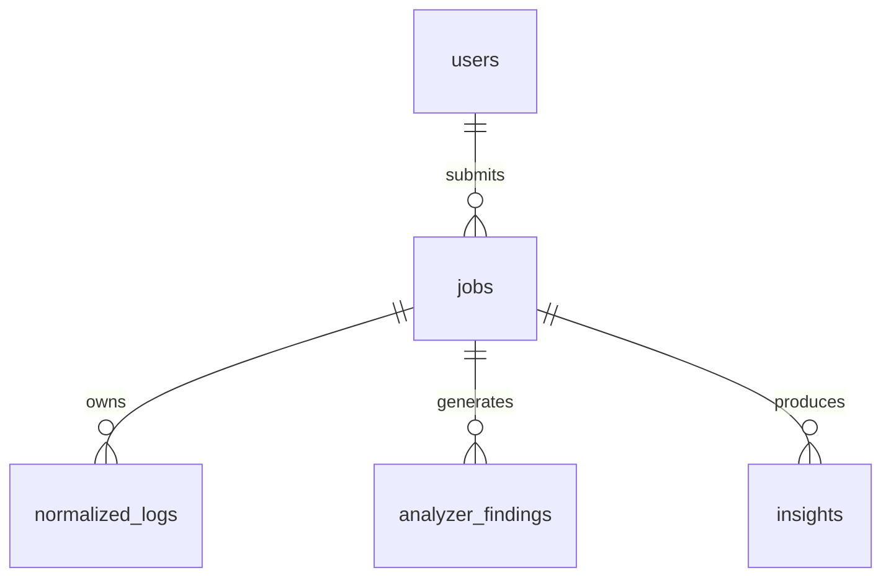

# 📘 SentinelX – Database Schema & Data Dictionary (Final)

---

## 1. Overview

The SentinelX database is designed to support a **log-based intrusion detection system (IDS)** with an asynchronous, job-driven processing pipeline. It utilizes **PostgreSQL** as its relational database back-end and **Prisma** as its Object-Relational Mapper (ORM).

This schema is aligned with:
* The **API layer** (multi-tenant, user authentication, and job-based async submission model).
* The **Processing pipeline** (stage-based execution, sliding window chunk processing, and boundary deduplication).
* The **System state modeling** (job status, last completed stage, and quality outcome).

---

## 2. Storage Strategy

SentinelX uses a **hybrid storage model**:
* **Raw log files** → Stored in the local file system (`/app/storage` or shared Docker volumes) to prevent database bloating.
* **Normalized log events** → Parsed and structured, bulk-inserted into PostgreSQL for fast query accessibility by analyzers.
* **Security findings & analytics** → Rules-based, statistical, and ML anomaly findings are stored in PostgreSQL with high-granularity metadata and relation constraints.

---

## 3. Core Data Model

---

## 4. Users Table (`users`)

Stores user credentials and profile information for system access control.

### Data Dictionary

| Field | Type | Attributes | Description |
| :--- | :--- | :--- | :--- |
| `id` | UUID | PRIMARY KEY, Default: `uuid_generate_v4()` | Unique user identifier. |
| `email` | VARCHAR(255) | UNIQUE, NOT NULL | User email address used for login authentication. |
| `password_hash` | TEXT | NOT NULL | Salted bcrypt hash of the password. |
| `first_name` | VARCHAR(100) | Nullable | User's first name. |
| `last_name` | VARCHAR(100) | Nullable | User's last name. |
| `created_at` | TIMESTAMP(6) | Default: `now()` | Account registration timestamp. |
| `updated_at` | TIMESTAMP(6) | Default: `now()`, Auto-update | Last account modification timestamp. |

### Indexes
* `idx_users_email` (B-Tree on `email`): Speed up authentication lookups.

---

## 5. Jobs Table (`jobs`)

Tracks the processing lifecycle of uploaded log files.

### Data Dictionary

| Field | Type | Attributes | Description |
| :--- | :--- | :--- | :--- |
| `id` | UUID | PRIMARY KEY, Default: `uuid_generate_v4()` | Unique job identifier. |
| `user_id` | UUID | FOREIGN KEY (`users.id`), NOT NULL | Owner of the job. Deletes cascadingly with the user. |
| `job_name` | VARCHAR(255) | Nullable | Human-readable name for the analysis job. |
| `file_path` | TEXT | NOT NULL | Location of the raw uploaded log file on disk. |
| `file_name` | TEXT | NOT NULL | Original filename of the uploaded file. |
| `file_size` | BIGINT | NOT NULL | Size of the log file in bytes. |
| `status` | ENUM (`job_status_enum`) | Default: `UPLOADED` | Current state in the processing queue. |
| `last_completed_stage` | ENUM (`job_stage_enum`)| Nullable | Last successfully finalized pipeline execution stage. |
| `outcome` | ENUM (`job_outcome_enum`) | Nullable | Overall result quality evaluation. |
| `progress` | INT | Default: `0`, Range: `0–100` | Percent progress of execution. |
| `retry_count` | INT | Default: `0` | Number of reprocessing attempts after transient errors. |
| `error_message` | TEXT | Nullable | Error stack or failure description if job status is `FAILED`. |
| `processing_metadata` | JSONB | Nullable | Stores type detection parser metrics, confidence, and file encoding. |
| `created_at` | TIMESTAMP(6) | Default: `now()` | Ingestion start timestamp. |
| `updated_at` | TIMESTAMP(6) | Default: `now()` | Last job metadata update. |
| `deleted_at` | TIMESTAMP(6) | Nullable | Soft-delete timestamp. |

### Lifecycle State Enums

#### 1. `job_status_enum` (Status)
Tracks high-level system scheduling states:
* `UPLOADED`: Added to the system, awaiting queue picking.
* `PROCESSING`: Undergoing active extraction, parsing, or analysis.
* `COMPLETED`: Run finished successfully or with partial warnings.
* `FAILED`: Errored out and ceased execution.

#### 2. `job_stage_enum` (Stage)
Tracks detailed pipeline processing checkpoints:
* `UPLOADED`
* `PREPROCESSED`
* `TYPE_DETECTED`
* `PARSED`
* `NORMALIZED`
* `ANALYZED`
* `INSIGHTS_GENERATED`
* `COMPLETED`

#### 3. `job_outcome_enum` (Outcome)
Represents the quality check status of a finished job (only applicable when status = `COMPLETED`):
* `SUCCESS`: Complete run without secondary service exceptions.
* `WARNING`: Partial findings generated, but sub-processes (e.g., machine learning service downtime) failed.

### Indexes
* `idx_jobs_user_id` (B-Tree on `user_id`): Optimize user dashboards.
* `idx_jobs_status` (B-Tree on `status`): Accelerate queue management operations.
* `idx_jobs_created_at` (B-Tree on `created_at`): Speed up timeline sorting.

---

## 6. Normalized Logs Table (`normalized_logs`)

Stores structured log events parsed from raw uploads.

### Data Dictionary

| Field | Type | Attributes | Description |
| :--- | :--- | :--- | :--- |
| `id` | UUID | PRIMARY KEY, Default: `uuid_generate_v4()` | Unique log event identifier. |
| `job_id` | UUID | FOREIGN KEY (`jobs.id`), NOT NULL | Owning job identifier. Cascades on job deletion. |
| `timestamp` | TIMESTAMP(6) | NOT NULL | Extracted event execution time. |
| `source` | VARCHAR(100) | Nullable | Event generator or log component. |
| `event_type` | VARCHAR(100) | Nullable | Action type (e.g., `LOGIN_FAILURE`, `API_REQUEST`). |
| `ip_address` | VARCHAR(50) | Nullable | Extracted origin IP address. |
| `severity` | VARCHAR(50) | Nullable | Event severity (e.g., `ERROR`, `WARNING`, `INFO`). |
| `metadata` | JSONB | Nullable | Dynamic, parser-specific fields (endpoints, user agents, user IDs, raw lines). |
| `created_at` | TIMESTAMP(6) | Default: `now()` | Database ingestion timestamp. |

### Indexes
* `idx_logs_job_id` (B-Tree on `job_id`): Core correlation queries.
* `idx_logs_timestamp` (B-Tree on `timestamp`): Time-series scanning and sliding window boundary queries.
* `idx_logs_ip` (B-Tree on `ip_address`): Quick query filters by actor IP.

---

## 7. Analyzer Findings Table (`analyzer_findings`)

Stores security threat matches, temporal issues, or ML anomalies detected in normalized logs.

### Data Dictionary

| Field | Type | Attributes | Description |
| :--- | :--- | :--- | :--- |
| `id` | UUID | PRIMARY KEY, Default: `uuid_generate_v4()` | Unique finding identifier. |
| `job_id` | UUID | FOREIGN KEY (`jobs.id`), NOT NULL | Owning job identifier. Cascades on job deletion. |
| `fingerprint` | VARCHAR | UNIQUE, NOT NULL | Deduplication fingerprint generated via cryptographic hash (SHA-256). |
| `analyzer` | VARCHAR(100) | NOT NULL | Analyzer engine (e.g., `rule`, `statistical`, `temporal`, `correlation`, `ml`). |
| `analyzer_version` | VARCHAR(20) | Nullable | Engine code version. |
| `finding_type` | VARCHAR(100) | NOT NULL | Threat class (e.g., `BRUTE_FORCE`, `SQL_INJECTION`, `ANOMALOUS_BEHAVIOR`). |
| `category` | VARCHAR(100) | Nullable | Broad group categorization for filtering. |
| `severity` | ENUM (`analyzer_finding_severity`) | NOT NULL | Threat level: `CRITICAL`, `HIGH`, `MEDIUM`, `LOW`, `INFO`. |
| `confidence` | Float | Nullable | Probabilistic confidence score (0.0 to 1.0). |
| `title` | TEXT | Nullable | Short, human-readable summary of the alert. |
| `summary` | TEXT | Nullable | Descriptive paragraph detail. |
| `recommendation` | TEXT | Nullable | Actions recommended to mitigate the security event. |
| `log_references` | JSONB | Nullable | Array of UUIDs linking back to the triggering `normalized_logs`. |
| `affected_entities` | JSONB | Nullable | Identifiers for target assets (IP addresses, specific user accounts). |
| `evidence` | JSONB | Nullable | Trigger metadata, parameters, payload data, and ratio values. |
| `metadata` | JSONB | Nullable | Extensible secondary info fields. |
| `status` | ENUM (`analyzer_finding_status`) | Default: `ACTIVE` | Interactive finding state. |
| `detected_at` | TIMESTAMP(6) | Default: `now()` | Timestamp of finding detection. |
| `created_at` | TIMESTAMP(6) | Default: `now()` | Database insertion timestamp. |
| `updated_at` | TIMESTAMP(6) | Default: `now()`, Auto-update | Last modification time. |

### Severity and Status Enums

#### 1. `analyzer_finding_severity`
* `CRITICAL`
* `HIGH`
* `MEDIUM`
* `LOW`
* `INFO`

#### 2. `analyzer_finding_status`
* `ACTIVE`
* `RESOLVED`
* `DISMISSED`
* `DUPLICATE`

### Indexes
* `idx_findings_job_id` (B-Tree on `job_id`): Findings load operations.
* `idx_findings_severity` (B-Tree on `severity`): Risk distribution rendering.
* `idx_findings_type` (B-Tree on `finding_type`): Threat summary aggregation.
* `idx_findings_analyzer` (B-Tree on `analyzer`): Audit reporting filters.
* `idx_findings_detected_at` (B-Tree on `detected_at`): Time series graphing.
* `idx_findings_status` (B-Tree on `status`): Finding status categorization.
* `idx_findings_fingerprint` (B-Tree on `fingerprint`): Quick lookups during window deduplication.

---

## 8. Insights Table (`insights`)

Stores final high-level intelligence and metrics generated for the user interface.

### Data Dictionary

| Field | Type | Attributes | Description |
| :--- | :--- | :--- | :--- |
| `id` | UUID | PRIMARY KEY, Default: `uuid_generate_v4()` | Unique insight identifier. |
| `job_id` | UUID | FOREIGN KEY (`jobs.id`), NOT NULL | Owning job identifier. Cascades on job deletion. |
| `insight_type` | ENUM (`insight_type`) | NOT NULL | Type identifier for layout rendering. |
| `title` | VARCHAR(255) | Nullable | Headline message. |
| `description` | TEXT | Nullable | Paragraph summary explaining the analytical insight. |
| `severity` | ENUM (`insight_severity`) | Nullable | Overall calculated threat severity. |
| `priority_score` | Float | Nullable | Derived sort priority weighting. |
| `confidence_score`| Float | Nullable | Combined metric accuracy assessment. |
| `data` | JSONB | NOT NULL | Structured JSON data required for component graphs (e.g. lists, data series). |
| `generated_by` | ENUM (`insight_generator`) | Default: `LLM` | Generator tool identifier (`LLM`, `DETERMINISTIC`, `HYBRID`). |
| `model_name` | VARCHAR(100) | Nullable | Name of model (if generated by LLM). |
| `generation_version`| VARCHAR(50) | Nullable | Version of parser logic or prompt sequence. |
| `finding_references`| JSONB | Nullable | Array of references linking to `analyzer_findings` tables. |
| `log_references` | JSONB | Nullable | Array of references linking to `normalized_logs` tables. |
| `is_visible` | Boolean | Default: `true` | UI rendering visibility control. |
| `display_order` | INT | Nullable | UI layout placement order. |
| `metadata` | JSONB | Nullable | Secondary extensible metadata. |
| `created_at` | TIMESTAMP(6) | Default: `now()` | Ingestion timestamp. |
| `updated_at` | TIMESTAMP(6) | Default: `now()`, Auto-update | Last modification timestamp. |

### Insight Enums

#### 1. `insight_type`
Specifies standard insight visualization configurations:
* `OVERVIEW`, `KPI`, `ALERT`, `THREAT_SUMMARY`
* `SEVERITY_DISTRIBUTION`, `ACTIVITY_TIMELINE`, `THREAT_TIMELINE`
* `TOP_ATTACKERS`, `RECOMMENDATION`, `ATTACK_PATTERN`
* `PORT_SCAN_PATTERN`, `FAILED_LOGIN_ANALYSIS`, `TRAFFIC_SPIKE`
* `EVENT_TYPE_DISTRIBUTION`, `GEO_ANALYSIS`, `SUSPICIOUS_IP_CLUSTER`
* `ANOMALY_SUMMARY`, `ATTACK_CAMPAIGN`

#### 2. `insight_severity`
* `CRITICAL`, `HIGH`, `MEDIUM`, `LOW`, `INFO`

#### 3. `insight_generator`
* `LLM`, `DETERMINISTIC`, `HYBRID`

### Indexes
* `idx_insights_job_id` (B-Tree on `job_id`): Dashboard API lookup optimization.
* `idx_insights_insight_type` (B-Tree on `insight_type`): Fetching particular widget datasets.
* `idx_insights_severity` (B-Tree on `severity`): Filtering high-severity alerts.

---

## 9. Design Decisions

### 1. Robust Constraint Cascade
All logs, findings, and insights are strongly bound to their parent `jobs` record using `ON DELETE CASCADE`. This ensures clean database hygiene—deleting a job deletes all associated analysis records automatically, preventing database orphan records.

### 2. Double-Layer Checkpointing
The combination of `status` (overall job workflow lifecycle) and `last_completed_stage` (pipeline stage completion) prevents the system from getting lost. If a worker fails, it knows exactly which completed stage to read and where to resume.

### 3. Cryptographic Fingerprints for Sliding Windows
To support parallelized processing, logs are scanned in sliding windows of 5,000 logs. Because windows overlap to protect boundary attacks, duplicate findings are likely. SentinelX generates a SHA-256 fingerprint from:
`analyzer + finding_type + affected_entities + first_10_log_references`
If a fingerprint conflict occurs, Postgres skips it on insert, preventing UI duplicates.

### 4. Dynamic JSONB Extensibility
By relying on `JSONB` for event-specific data (e.g. `evidence`, `metadata`, `data`), the schema keeps Postgres structured while remaining flexible enough to ingest Apache, Nginx, Linux auth, or custom firewall log fields.
