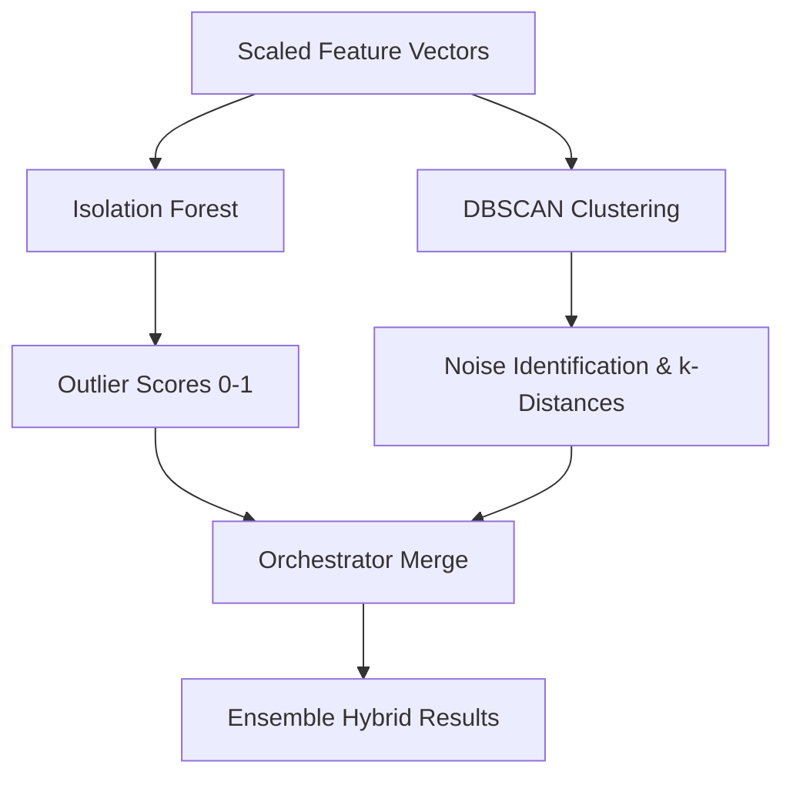

# 🧠 SentinelX – Machine Learning Model Specification

---

## 1. Overview

The SentinelX Machine Learning (ML) service is a dedicated FastAPI-based analytical component designed to perform **unsupervised anomaly detection** on system access records. By modeling normal behavioral baselines, the ML service detects zero-day threats, anomalous lateral movement, automated scanning patterns, and credential stuffing attacks that rule-based systems might miss.

The service is fully containerized and executes two complementary unsupervised learning algorithms:
1. **Isolation Forest** (efficient at isolating anomalies across multidimensional space).
2. **DBSCAN Clustering** (highly effective at finding density-based groupings and labeling outliers as noise).

---

## 2. Feature Extraction & Vector Representation

Before sending data to the ML service, the SentinelX backend parses normalized database log events to build feature vectors. Features are grouped into three distinct analytical scopes (entities):

### A. IP-specific Features
Model the behavior of network addresses:
* `requestCount`: Total requests sent in the time-frame.
* `uniqueEndpointsAccessed`: Number of unique paths requested.
* `failedLoginAttempts`: Number of authentication failures.
* `authFailureRatio`: Ratio of failed logins to total login attempts.
* `errorRate`: Ratio of `4xx` and `5xx` responses to total responses.
* `hoursActive`: Number of active hours in the timeframe.

### B. User-specific Features
Model human actor or system account behavior:
* `distinctIpsUsed`: Multi-location access indicators.
* `geographicDiversityScore`: Index representing the distance between access regions.
* `distinctEndpointsAccessed`: Specific service paths queried.
* `adminAccessAttempts` / `privilegeEscalationAttempts`: Unauthorized role transitions.
* `weekendActivityLevel` / `nightTimeAccessCount`: Out-of-hours behavior metrics.

### C. Session-specific Features
Model temporal session lifecycles:
* `durationSeconds`: Lifespan of the authenticated session.
* `requestsPerMinute`: Event velocity inside a session.
* `requestIntervalVariance`: Inconsistency of request intervals (helps differentiate humans from bots).
* `dataUploadedBytes` / `dataDownloadedBytes`: Data transfer volume characteristics.

---

## 3. Data Preprocessing

To ensure optimal model performance, the ML service runs a preprocessing pipeline on incoming feature matrices:

### A. Missing Values and Infinity Handling
Features that are not applicable to specific entity categories are transmitted as `null` values.
* All `NaN` (Not a Number) values are replaced with `0.0` (neutral indicator).
* All `Inf` (Infinity) values resulting from division by zero are capped and filled with `0.0`.

### B. Scaling & Normalization
Features are normalized using a global scaler to prevent columns with large absolute bounds (e.g. `dataDownloadedBytes`) from dominating columns with smaller values (e.g. `authFailureRatio` between 0 and 1).
* **Scaler**: `StandardScaler` (Z-score normalization).
  $$z = \frac{x - \mu}{\sigma}$$
  *Where $\mu$ is the mean and $\sigma$ is the standard deviation.*
* **Alternative Config**: Supports `MinMaxScaler` (normalizing features to a strict `[0, 1]` range).

---

## 4. Machine Learning Algorithms



### 1. Isolation Forest (IF)

#### Theoretical Foundation
Isolation Forest isolates anomalies instead of profiling normal data points. It builds a forest of binary partition trees (`ExtraTreeRegressor`). Because anomalies have atypical feature values, they require fewer random splits to be isolated in tree leaf nodes, resulting in shorter path lengths from the tree root.

#### Parameters
* `n_estimators`: `100` (number of decision trees).
* `contamination`: `0.05` (expected proportion of outliers in dataset, defining the boundary decision threshold).
* `random_state`: `42` (for reproducibility).

#### Score Mapping
Sklearn's raw anomaly score is mapped into a normalized $[0, 1]$ interval:
$$\text{normalized\_score} = \frac{1}{1 + e^{-s}}$$
*Where $s$ is the decision function output.*
We invert the normalized score so that **higher values represent higher anomaly risk**:
$$\text{anomaly\_score} = 1.0 - \text{normalized\_score}$$

---

### 2. DBSCAN (Density-Based Spatial Clustering)

#### Theoretical Foundation
DBSCAN clusters data based on spatial density. It identifies Core points, Border points, and Noise points. Points located in low-density areas (with fewer than `min_samples` neighbors within distance `eps`) are categorized as noise points and assigned a label of `-1`.

#### Parameters
* `eps` (Epsilon): `0.3` (maximum spatial distance to define neighboring points).
* `min_samples`: `5` (minimum points required to form a core density cluster).
* `metric`: `"euclidean"` (straight-line distance calculation).

#### Anomaly Scoring Method
Standard DBSCAN only output binary classification (`-1` noise or `cluster_id`). SentinelX computes a continuous $[0, 1]$ anomaly score using **k-nearest neighbors (k-NN) distances**:
1. A NearestNeighbors model fits the feature space with `n_neighbors = min_samples`.
2. For each point, the distance to its $k$-th neighbor is calculated (k-distance).
3. The k-distances are normalized by the maximum distance found in the dataset.
4. **Scoring Logic**:
   * If label $= -1$ (noise point): Assign a maximum anomaly score of `1.0`.
   * If label $\ge 0$ (clustered point): Assign the normalized k-distance (representing how close the point is to the cluster boundary).

---

## 5. Orchestration and Merge Logic

The `OrchestratorService` runs both Isolation Forest and DBSCAN in parallel to create an **ensemble prediction system**:

1. **Risk Maximization**: If an entity is analyzed by both models, the orchestrator keeps the highest calculated risk assessment.
   $$\text{Final Risk} = \max(\text{Risk}_{\text{IF}}, \text{Risk}_{\text{DBSCAN}})$$
2. **Reason Aggregation**: Outlier reasons from both models are combined and deduplicated.
3. **Algorithm Attribution**: The system labels the detection method as `Hybrid` if both flagged it, or matches the respective algorithm name.

---

## 6. Risk Level Mapping

The mapped anomaly scores ($[0, 1]$) are grouped into security risk categories:

| Score Range | Risk Level | Description |
| :--- | :--- | :--- |
| $\ge 0.8$ | **CRITICAL** | Highly anomalous behavior. Immediate investigation suggested. |
| $[0.6, 0.8)$ | **HIGH** | Significant deviation from baseline. Potential threat. |
| $[0.4, 0.6)$ | **MEDIUM** | Moderate variance. Worth review under correlation rules. |
| $< 0.4$ | **LOW** | Normal behavior. Aligns with standard baselines. |

---

## 7. API Interface Contract

### POST `/analyze`

#### Request Payload
```json
{
  "vectors": [
    {
      "entity": "ip:192.168.1.105",
      "requestCount": 420.0,
      "uniqueEndpointsAccessed": 3.0,
      "failedLoginAttempts": 12.0,
      "authFailureRatio": 0.85
    },
    {
      "entity": "ip:10.0.0.12",
      "requestCount": 15.0,
      "uniqueEndpointsAccessed": 2.0,
      "failedLoginAttempts": 0.0,
      "authFailureRatio": 0.0
    }
  ],
  "modelConfig": {
    "contamination": 0.05,
    "eps": 0.3,
    "minSamples": 5
  }
}
```

#### Response Payload
```json
{
  "status": "success",
  "model": "Hybrid",
  "analysisId": "e30bde1a-3a85-4dbb-82a1-a75bc0d17ff2",
  "timestamp": "2026-06-04T04:30:00Z",
  "vectorsProcessed": 2,
  "results": [
    {
      "entity": "ip:192.168.1.105",
      "anomalyScore": 0.854,
      "anomalyDecision": -1,
      "risk": "CRITICAL",
      "confidence": 0.854,
      "featureContributions": {
        "failedLoginAttempts": 12.0,
        "authFailureRatio": 0.85
      },
      "topAnomalousFeatures": [
        {
          "feature": "failedLoginAttempts",
          "value": 12.0,
          "anomalyRatio": 0.95
        },
        {
          "feature": "authFailureRatio",
          "value": 0.85,
          "anomalyRatio": 0.85
        }
      ],
      "reasons": [
        "Point identified as outlier/noise in clustering",
        "Anomaly score: 85.40%",
        "Top anomalous features: failedLoginAttempts, authFailureRatio"
      ],
      "detectionMethod": "Hybrid",
      "timestamp": "2026-06-04T04:30:00Z"
    }
  ],
  "statistics": {
    "totalVectors": 2,
    "anomaliesDetected": 1,
    "criticalCount": 1,
    "highCount": 0,
    "mediumCount": 0,
    "lowCount": 0,
    "avgAnomalyScore": 0.477
  }
}
```
